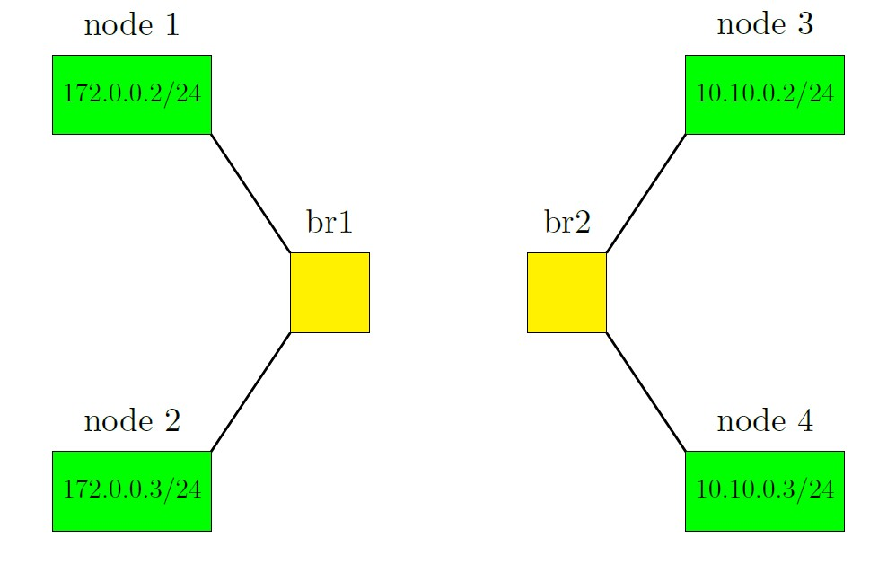
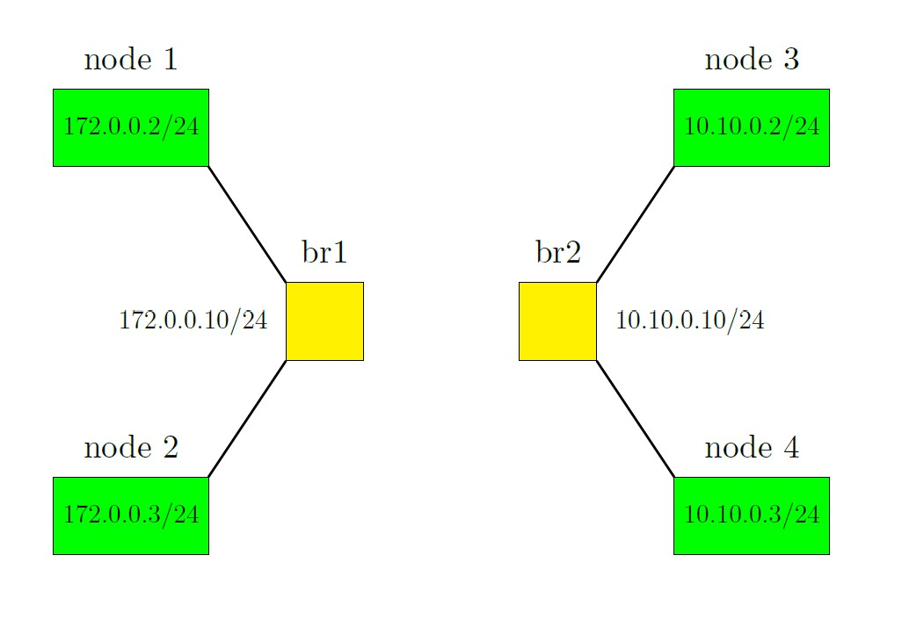

# Ping Nodes Without Router

If we don't add anything to our bash script for the last part and we just delete the router, then two subnets can't ping each other. In this case topology is show in the figure below:



The reason of this behaviour is that we don't have bridge 1 and bridge 2 in our routing table in the root namespace. So if node 1 sends an icmp packet it goes to bridge 1 but after that it has no route to go. For solving this problem we suggest figure below:



If you look at figure above you can see we assigned ip to the bridges. It can be done with these commands:

```console
ip addr add 172.0.0.10/24 brd + dev br1
ip addr add 10.10.0.10/24 brd + dev br2
```

Now we have these two subnets in root namespace's routing table. So if bridge 1 receives a packet from node 1, it sends the packet directly to bridge 2 and everything works fine.
