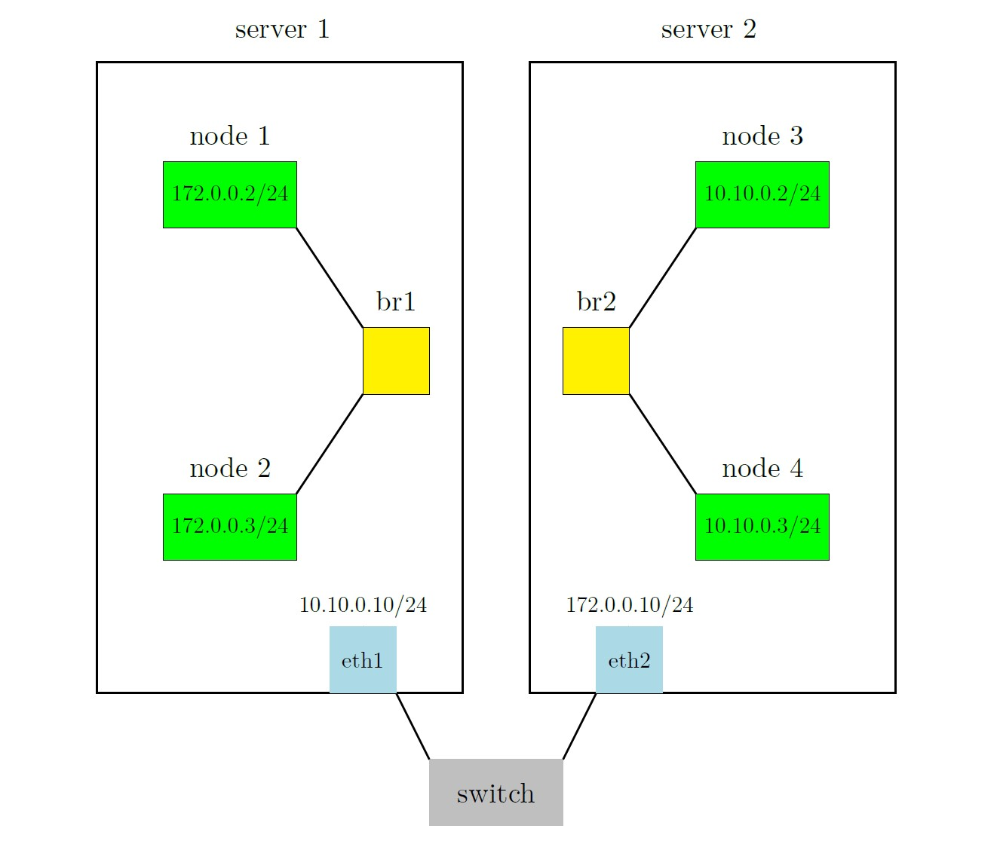

# Ping Nodes in Different Servers

For this section we can do something like figure below:

It means that we can assign an ip address which belongs to the subnet of the server 2 to the left interface of switch which is in the server 1 (eth 1 in the figure). Also we can do the same for eth 2.

Now lets look at a packet that sended from node 1 and its destination is node 3. Because of the gateway of node 1 it will be going to br 1 directly. After that because bridge 1 has 10.10.0.0 in its routing table (eth 1), it sends the packet to the switch and switch sends packet to the server 2. Now eth 2 sends the packet to the bridge 2 and it forwards packet to node 3 and all things will working fine.