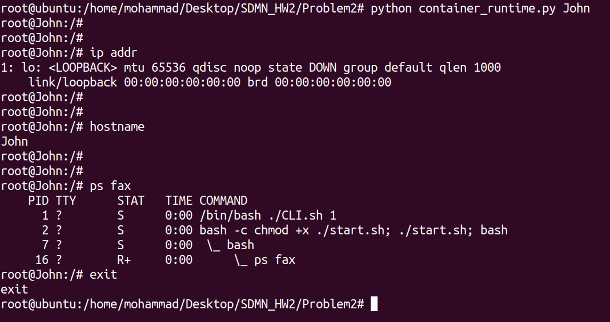
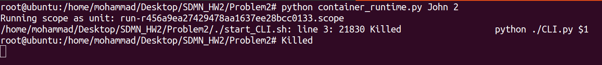
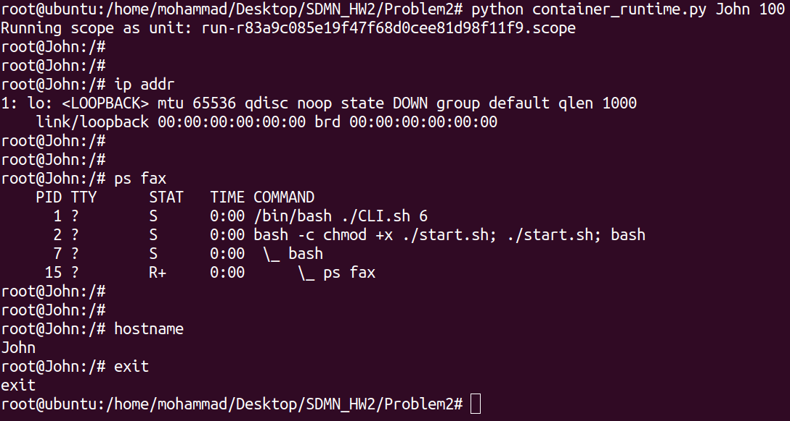

# Container Runtime

## Get Ubuntu 20.04 Files

First you should have root access using this command and enter your password:

```console
sudo -i
```

If you don't have ubuntu 20.04 files on your system run commands below for getting them. Otherwise you should copy your files in a folder named "chroot-jail" and skip this part.

```console
chmod +x ./focal.sh
./focal.sh
```

## Run Container Runtime

Now it is time to run our container.

### Run Without Momory Limitation

If you don't want to use memory usage limitation option you need to execute this command:

```console
python container_runtime.py <your hostname>
```

For example if we want to enter a container with "John" as its hostname we should run this command:

```console
python container_runtime.py John
```

And the output will be like this:



As you can see we have net isolation and hostname is "John" ( As we wanted ). Also if we use `ps fax` we can see the PID of bash is 1.

### Run With Momory Limitation

If you want to use memory usage limitation option you should pass a second optional argument to the python file. This optional argument is the maximum memory usage in megabytes. So we can use this command:

```console
python container_runtime.py <your hostname> <maximum memory usage(in Mb)>
```

For example if we want to have a container with "John" as its hostname and also we want container to use at most 2 Mb of memory we can use this code:

```console
python container_runtime.py John 2
```

The output would be like this after running this command:



As you can see in the figure above we exeed memory limit during running command. If we use 100 Mb instead of 2 Mb the output will be like this:



And container works fine.